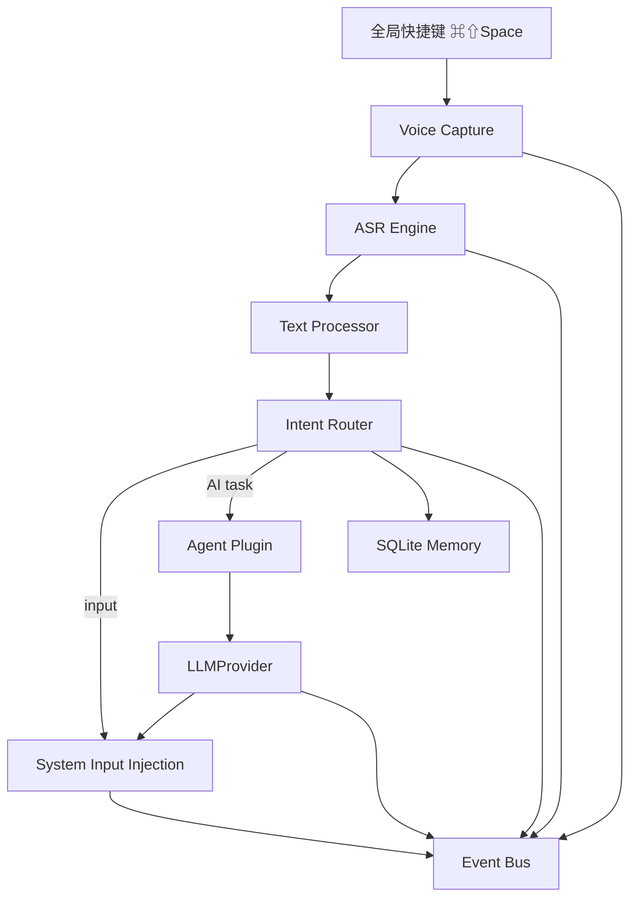

# VoiceForge 架构与扩展约定

## 主流程



Swift 与 Python 的责任边界：

- Swift：全局快捷键、菜单栏状态、Accessibility、焦点/选区、文本注入；
- Python：音频采集、ASR、文本处理、意图、Agent、LLM、Memory、事件；
- 进程通信：仅监听 `127.0.0.1:8765` 的 JSON HTTP API。

## Event Bus 主题

| 主题 | 产生时机 |
|---|---|
| `voice.capture.started` | 音频流开始 |
| `voice.capture.completed` | WAV 语句完成 |
| `voice.text.received` | ASR 文本完成 |
| `agent.intent.detected` | 路由结果完成 |
| `llm.response.completed` | Agent LLM 返回 |
| `text.inject.completed` | Swift 完成输入 |
| `service.state.changed` | Ready/Listening/Processing/Error 切换 |
| `service.error` | 任一主流程错误 |

所有事件写入 SQLite，未来可以把 `EventBus` 的订阅者替换为 A2A、消息队列
或 Research OS Harness，不需要修改业务模块。

## 增加 Agent

实现 `backend.agent.base.AgentPlugin`：

```python
class PatentAgent:
    intent = "patent"

    def run(self, context, llm):
        return llm.chat([...])
```

然后在 `create_default_registry()` 中注册，并在 `IntentRouter._RULES` 增加
确定性的触发规则。普通输入不经过 LLM 分类，是为了降低延迟并保护隐私。

## 增加 ASR

实现以下接口：

```python
class NewASR:
    name = "new-asr"

    def transcribe(self, audio_path: Path) -> Transcription:
        ...
```

在 `backend/asr/factory.py` 注册即可。增量流式 ASR 可以扩展为
`start/push_chunk/finish` 协议，再通过事件总线持续发布 partial 文本。

## Memory 与未来 RAG

当前 SQLite 包含：

- `entries`：输入、输出与意图元数据；
- `preferences`：语言、风格等键值偏好；
- `terms`：专业词替换表；
- `events`：完整本地事件轨迹。

未来 RAG 应新增独立的文档、分块和向量索引表/服务；不要把向量字段直接塞入
`entries`，以免输入历史和知识库生命周期耦合。
